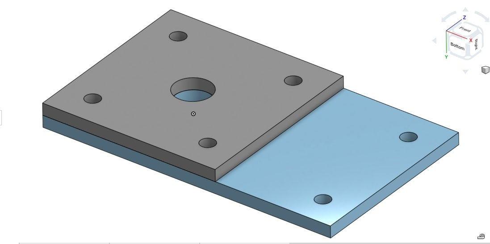
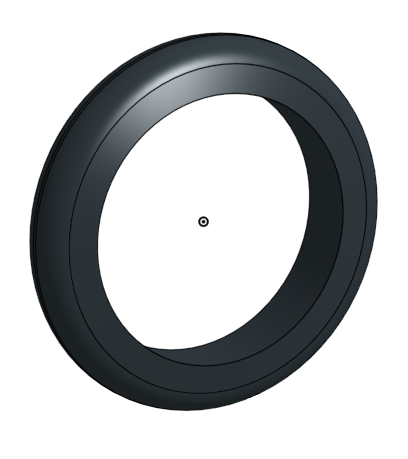

# BasicCAD

We are creating a caster.

---
## Table of Contents
* [Table of Contents](#Table-of-Contents)
* [Base](#Base)
* [Mount](#Mount)
* [Fork](#Fork)
* [Tire](#Tire)
* [Wheel](#Wheel)
* [AxleCollarBearings](#AxleCollarBearings)

## Base

### Description

The first assignment is to create the caster base.  The base's dimensions are 200 mm x 120 mm and 8 mm thick.  It has 6 holes 10 mm wide and 20 mm from the edge equally spaced along the edges.

### Evidence
[The Base in Onshape](https://cvilleschools.onshape.com/documents/927915425b900e39900be1d1/w/ce34bb8be3d17142ba8f5a39/e/917e48ae5d47e0ff55b22eeb)

### Image
This is my Base.
~~~

~~~

### Reflection

This was my first Onshape part and [following along with Dr. Shields made it super easy.](https://www.youtube.com/watch?v=93BFUD-HAG8&feature=emb_title&scrlybrkr=5670f0b4)  I learned about 
* sketching (shortcut **shift-s**)
* constructions lines (shortcut **Q**)
* dimensions (shortcut **D**)
* extruding both add and remove (shortcut key **E**)
* linear patterns (no shortcut)

Onshape is awesome.  I found it really helpful to rename all my sketches.  It is going to be a GREAT year in engineering.

---

## Mount

### Description
The mount is the second part of the Caster. The mount's dimensions are 120mm x 120mm extruded 8 mm. It has 4 holes 10 mm wide and 10 mm away from the wall's edge and 1 hole 25 mm wide in the center. 
### Evidence
[OnshapeMount](https://cvilleschools.onshape.com/documents/927915425b900e39900be1d1/w/ce34bb8be3d17142ba8f5a39/e/917e48ae5d47e0ff55b22eeb)
### Image

## Reflection
Something helpful and important to use when making the Mount is the Use tool. It is a cube on the tool bar and you can use it by selecting the edges and features you want to project into your new sketch. It was very helpful in making the process go much faster. 

## Fork

### Description
The fork is more complex and you need to know how to use more tools on Onshape in order to make it easily. Shortcut tools make this part go faster and easier to do. 
### Evidence
[ForkLink](https://cvilleschools.onshape.com/documents/927915425b900e39900be1d1/w/ce34bb8be3d17142ba8f5a39/e/9dd7429963bebce307ea0c64)
### Image

### Reflection
Something I would recomend learning to use before making the Fork would be the Fillet and Chamfer. The Fillet tool is used to round and soften hard edges. The chamfer is used to make a hard edge sloped in a certain direction. The difference between the fillet and the Chamfer is that the fillet tool rounds lines and edges while the Chamfer tool is used to slope the line down from one line to another slightly down. 

## Tire

### Description

### Evidence

### Image

### Reflection

---

## Wheel

### Description

### Evidence

### Image

### Reflection

---
4

## AxleCollarBearings

### Description

### Evidence

### Image

### Reflection

---
