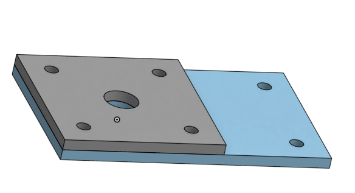
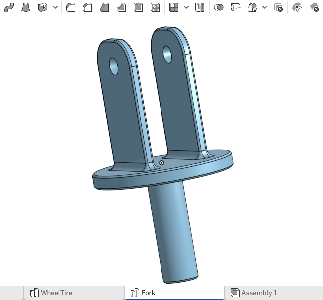
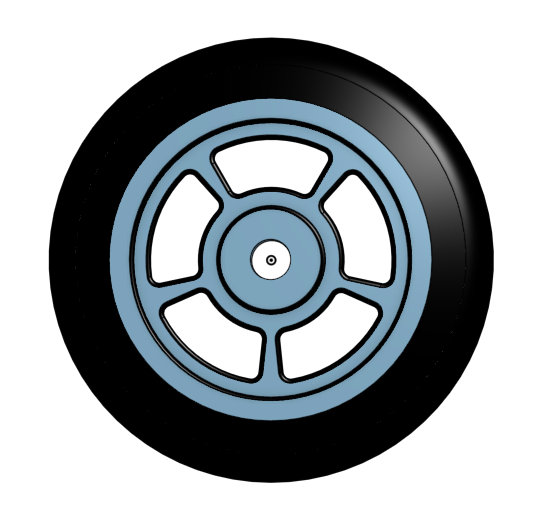
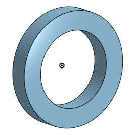
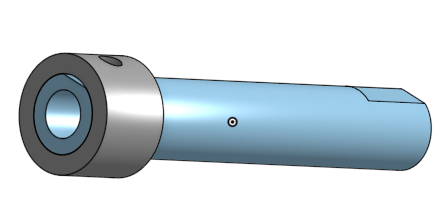
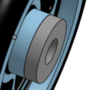

# BasicCAD

We are creating a caster.

---
## Table of Contents
* [Table of Contents](#Table-of-Contents)
* [Base](#Base)
* [Mount](#Mount)
* [Fork](#Fork)
* [Tire](#Tire)
* [Wheel](#Wheel)
* [AxleCollarBearings](#AxleCollarBearings)
* [SubAssembly](#SubAssembly)

## Base

### Description

The first assignment is to create the caster base.  The base's dimensions are 200 mm x 120 mm and 8 mm thick.  It has 6 holes 10 mm wide and 20 mm from the edge equally spaced along the edges.

### Evidence
[The Base in Onshape](https://cvilleschools.onshape.com/documents/927915425b900e39900be1d1/w/ce34bb8be3d17142ba8f5a39/e/917e48ae5d47e0ff55b22eeb)

### Image
This is my Base.
~~~

~~~

### Reflection

This was my first Onshape part and [following along with Dr. Shields made it super easy.](https://www.youtube.com/watch?v=93BFUD-HAG8&feature=emb_title&scrlybrkr=5670f0b4)  I learned about 
* sketching (shortcut **shift-s**)
* constructions lines (shortcut **Q**)
* dimensions (shortcut **D**)
* extruding both add and remove (shortcut key **E**)
* linear patterns (no shortcut)

Onshape is awesome.  I found it really helpful to rename all my sketches.  It is going to be a GREAT year in engineering.

---

## Mount

### Description
The mount is the second part of the Caster. The mount's dimensions are 120mm x 120mm extruded 8 mm. It has 4 holes 10 mm wide and 10 mm away from the wall's edge and 1 hole 25 mm wide in the center. 
### Evidence
[Onshape Mount](https://cvilleschools.onshape.com/documents/927915425b900e39900be1d1/w/ce34bb8be3d17142ba8f5a39/e/917e48ae5d47e0ff55b22eeb)
### Image

## Reflection
Something helpful and important to use when making the Mount is the Use tool. It is a cube on the tool bar and you can use it by selecting the edges and features you want to project into your new sketch. It was very helpful in making the process go much faster. 

## Fork

### Description
The fork is more complex and you need to know how to use more tools on Onshape in order to make it easily. Shortcut tools make this part go faster and easier to do. 
### Evidence
[Onshape Fork Link](https://cvilleschools.onshape.com/documents/927915425b900e39900be1d1/w/ce34bb8be3d17142ba8f5a39/e/9dd7429963bebce307ea0c64)
### Image

### Reflection
Something I would recomend learning to use before making the Fork would be the Fillet and Chamfer. The Fillet tool is used to round and soften hard edges. The chamfer is used to make a hard edge sloped in a certain direction. The difference between the fillet and the Chamfer is that the fillet tool rounds lines and edges while the Chamfer tool is used to slope the line down from one line to another slightly down. 

## Tire

### Description
The tire starts with a simple trapezoid with the bottom's points 20 mm apart. The sides of the trapezoid are equal and the bottom left point is 10 degrees from the origin. There's a construction line from the origin going out to the right and the distance from the bottom right point on the trapezoid and reflected over that horizontal line is 80 mm. The distance from the top right point of the trapezoid is 110 mm reflected over the horizontal center line. You then revolve the trapezoid and fillet the edges 8 mm. 
### Evidence
[Onshape Tire](https://cvilleschools.onshape.com/documents/927915425b900e39900be1d1/w/ce34bb8be3d17142ba8f5a39/e/640b708da3ca0a9004b344a1)
### Image

### Reflection
I wasn't sure how to get a degree dimension so I'll tell you how to.You need to click Dimension or use the shortcut by typing 'd' on the keyboard. First click on the bottom left point on the trapezoid, then click on the horizontal construction line coming from the origin. Onshape is smart and will realize what you are doing and make it a degree. Then proceed as you would a normal degree. 

## Wheel

### Description
The wheel starts with a simple 3 rectangle overlapping sketch on the right plane in the empty space inside the tire. You use construction lines before you sketch those rectangles because you will be revolving that sketch once you add the dimensions and trim the inside lines. The rectangle sketch should look like an Uppercase letter I once you have trimmed the inside and it is fully defined. You'll revolve the sketch around the horizontal construction line and then you'll cut out the spoke and circular pattern it so there are 5 spokes. I have put a link in my reflection if you need help making the inital spoke. 
### Evidence
[Onshape Wheel](https://cvilleschools.onshape.com/documents/927915425b900e39900be1d1/w/ce34bb8be3d17142ba8f5a39/e/640b708da3ca0a9004b344a1)
### Image

### Reflection
I accidentally made my tire on the front plane instead of the top plane so when I went to make my sketch on the right plane for the wheel that I was going to revolve it didn't seem right. I noticed my mistake from the tire and instead of redoing it which would have been a huge waste of time, I clicked on the sketch and selected the front plane instead of the right plane so that the sketch was perpendicular to the tire. I did this so that it would fit inside the tire correctly. 
When cutting out the spokes it is a bit complicated but [following along with Mr. H's video](https://www.youtube.com/watch?v=DbOjDNK8Nsk&feature=emb_title) made it easy. 

## AxleCollarBearings

### Description
To make the big bearing start a sketch on the front plane and draw 2 circles one within the other. Make the small one 20 mm and the large one 30 mm. Extrude the area between the 2 circles' lines 5 mm. To make the bearing on the wheel, USE the 2 circle lines on the center of the wheel that sticks out a bit. Now do the same thing you did with the big bearing and extrude the area between those 2 circle lines 5 mm. To make the axle and collar takes a little bit more time because there are more steps. I have linked a full explanatory video for all the parts in my reflection if you are stuck or if you need to make the axle and collar.
### Evidence
[Onshape link to the axel and collar](https://cvilleschools.onshape.com/documents/927915425b900e39900be1d1/w/ce34bb8be3d17142ba8f5a39/e/772e639fd437d905870e0171)

[Link to the big bearing](https://cvilleschools.onshape.com/documents/927915425b900e39900be1d1/w/ce34bb8be3d17142ba8f5a39/e/5a77d336633f9ce212caf637)

[onshape link to the bearing on the wheel](https://cvilleschools.onshape.com/documents/927915425b900e39900be1d1/w/ce34bb8be3d17142ba8f5a39/e/640b708da3ca0a9004b344a1)

### Image

### Reflection
A useful thing to know how to do is how to make a new part studio within a document so you aren't making many documents. This far into the process of making the Caster you should know this by now but I'll explain it anyway. Down at the bottom of your screen you will see little rectangular boxes that say something like Part Studio 1 because you havent renamed them anything yet. To rename them just right click and select rename. To make another part studio just click the plus pn the bottom left of the screen. [Here is the link for the part's how-To video](https://www.youtube.com/watch?v=2r7YqGuF1vY&feature=emb_title)

###SubAssembly

### Description
YOu make an Assembly studio at the bottom of the page and then insert the Wheel, tire, or them combined if you made them as one which I did, and 2 bearings. You want to fix the wheel to the origin. Then you will want to mate the tire and wheel together if they are not already one part. Select the fasten mate and then the 

### Evidence

### Image

### Reflection

